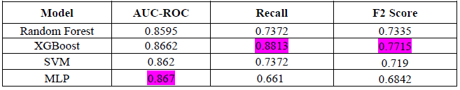
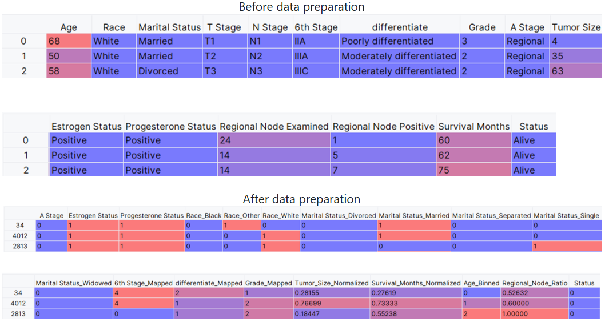

# Breast Cancer Survival Prediction (ML & Data Mining)

Course project: predicting patient survival (Alive/Dead) from clinical and demographic features using classic ML models.
Main focus: imbalanced classification, careful preprocessing + feature engineering, and model comparison.

**Course:** Data Mining and Learning Systems (M.Sc.)

---

## Highlights
- Models compared: **Random Forest, XGBoost, SVM, MLP**
- Hyperparameter tuning with **RandomizedSearchCV**
- Imbalance-aware evaluation: **AUC-ROC, Recall, F2**
- Feature selection with **RFECV**

---

## Results (high level)
In our experiments, **XGBoost** achieved the best overall tradeoff, with strong minority detection (Recall/F2), while **MLP** reached the highest AUC-ROC but weaker Recall/F2.

| Model | AUC-ROC | Recall | F2 |
|------|---------|--------|----|
| Random Forest | 0.8595 | 0.7372 | 0.7335 |
| XGBoost | 0.8662 | 0.8813 | 0.7715 |
| SVM | 0.8620 | 0.7372 | 0.7190 |
| MLP | 0.8670 | 0.6610 | 0.6842 |

---

## Data preparation (example)
We applied common steps for medical / tabular ML: outlier handling, scaling, encoding, and feature engineering (e.g., lymph node ratio).

---

## Repository contents
- `main.py` — full pipeline (preprocess → train/tune → evaluate)
- `requirements.txt` — dependencies
- `report.pdf` — full write-up (methods, tables, discussion)
- `assets/` — images shown in this README
- `Breast_Cancer.csv` — dataset (CC BY 4.0)

---

## Dataset
The dataset is based on Kaggle / SEER (NCI, Nov 2017 update).

**License:** CC BY 4.0  
This repository includes `Breast_Cancer.csv` under the terms of CC BY 4.0.  
**Attribution:** Dataset by `reihanenamdari` (Kaggle). Source: https://www.kaggle.com/datasets/reihanenamdari/breast-cancer
